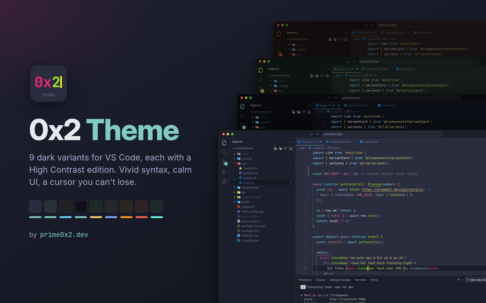
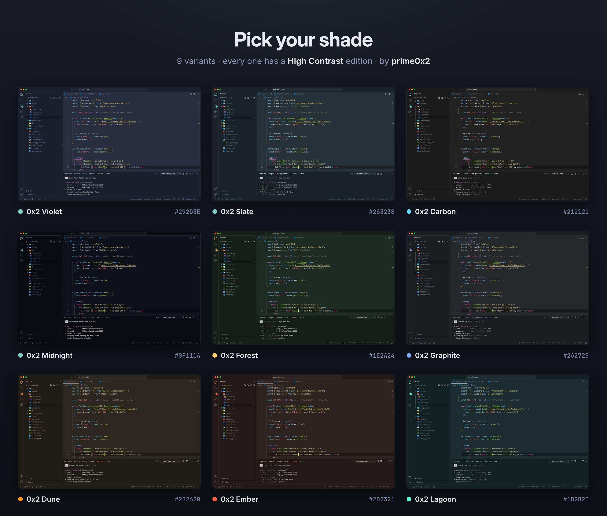
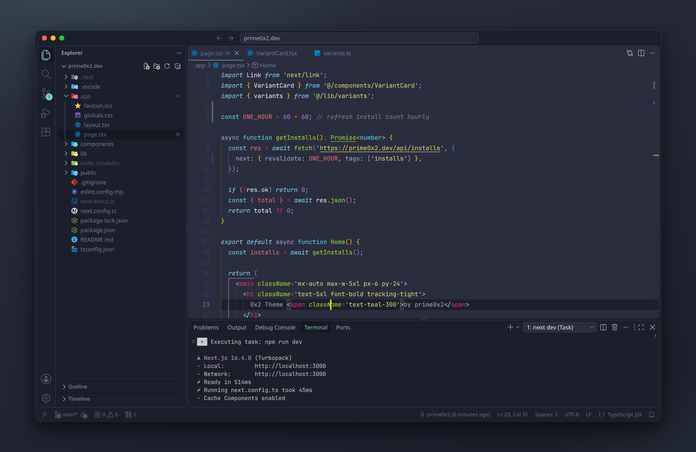
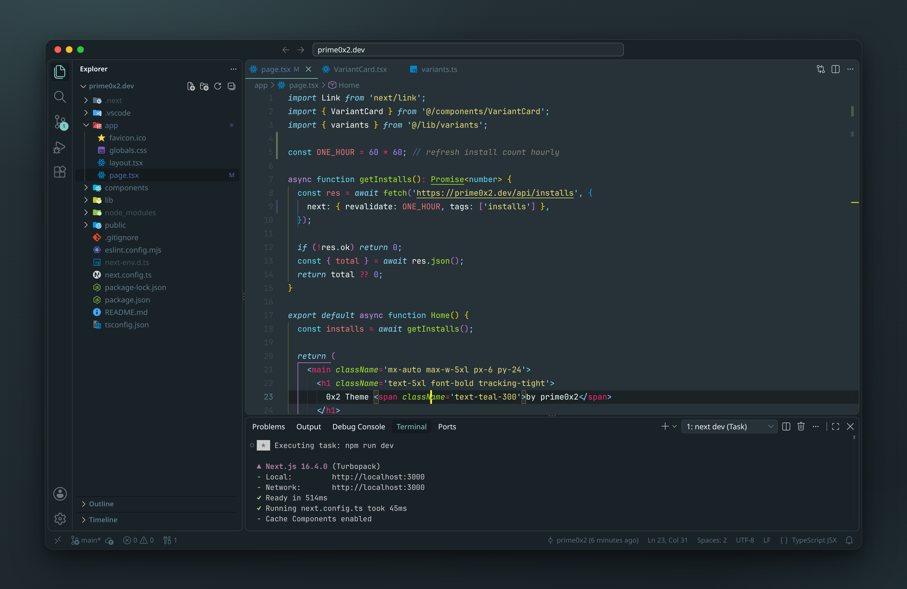
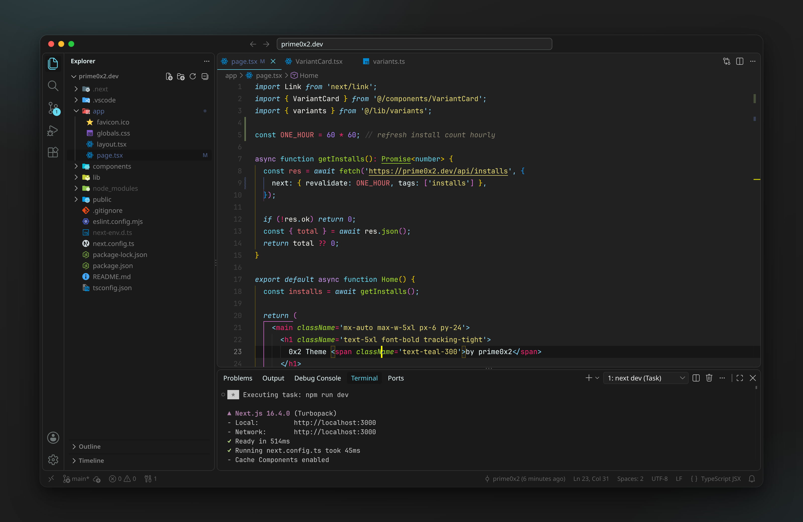
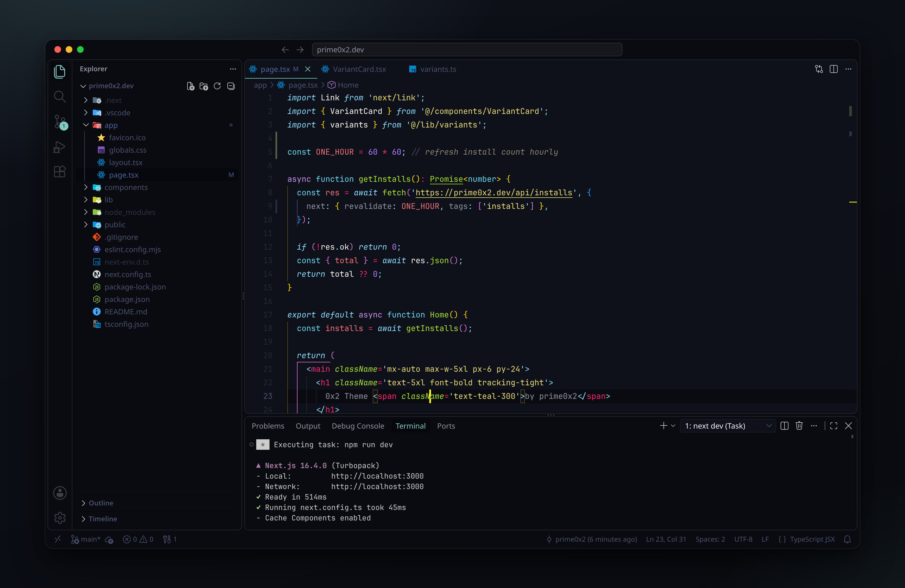
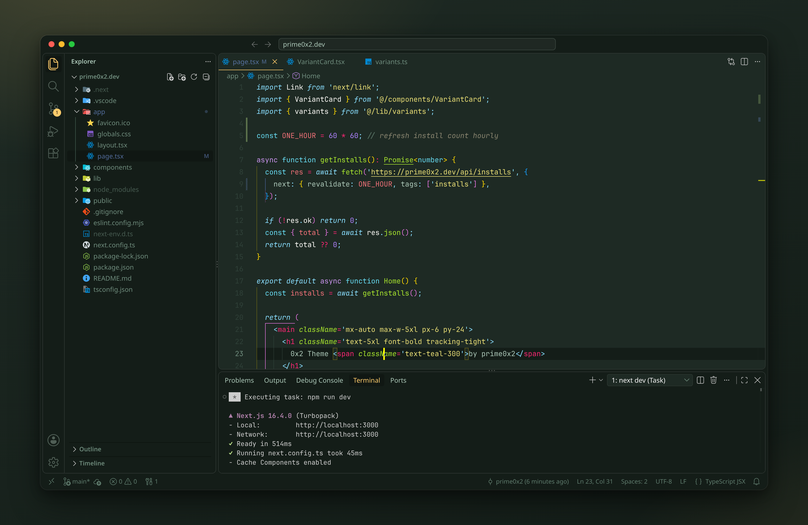
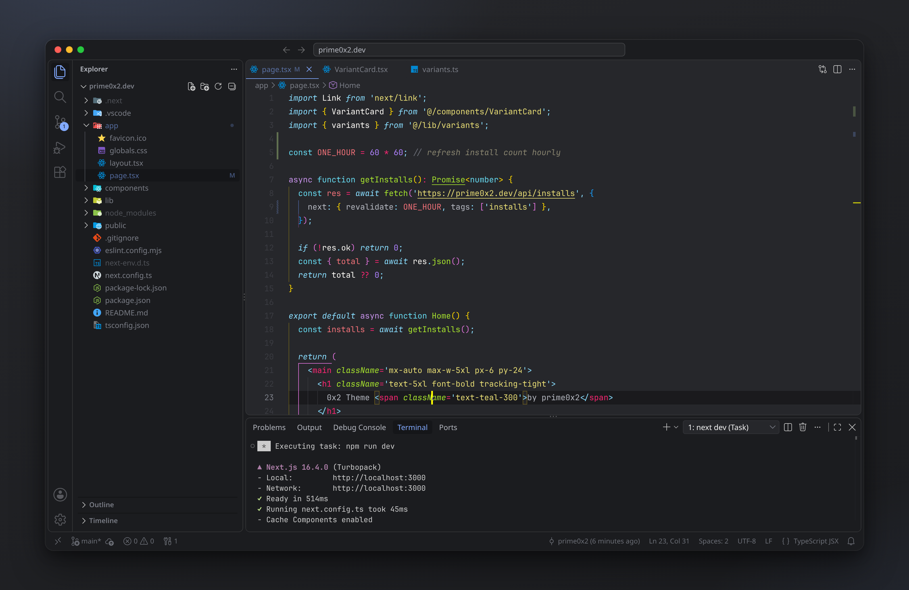
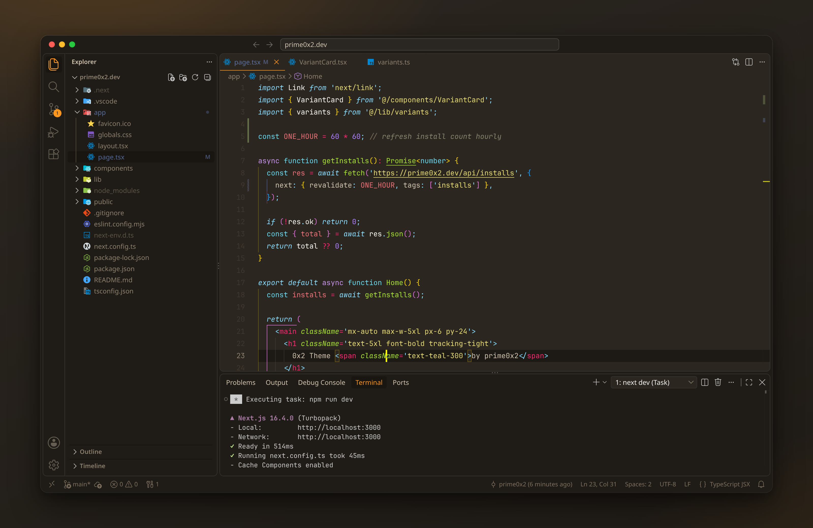
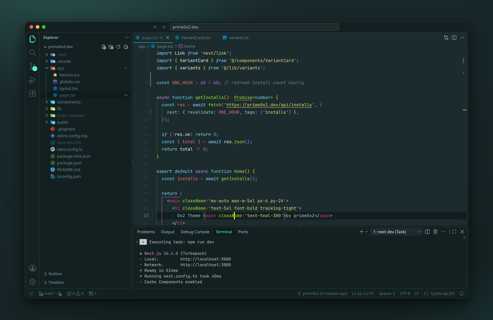

# 0x2 Theme

A dark VS Code theme with vivid syntax colors, a high-contrast UI and a bright yellow cursor you'll never lose.
Made by [prime0x2](https://prime0x2.dev/).

## Variants

9 dark variants, each in a normal and a **High Contrast** version (18 themes).

| Theme | Background | Accent |
| --- | --- | --- |
| **0x2 Violet** (recommended: High Contrast) | `#292D3E` | Teal `#80CBC4` |
| 0x2 Slate | `#263238` | Teal `#80CBC4` |
| 0x2 Carbon | `#212121` | Cyan `#66D9EF` |
| 0x2 Midnight | `#0F111A` | Teal `#80CBC4` |
| 0x2 Forest | `#1E2A24` | Amber `#FFCB6B` |
| 0x2 Graphite | `#26272B` | Blue `#82AAFF` |
| 0x2 Dune | `#2B2620` | Orange `#FD971F` |
| 0x2 Ember | `#2D2321` | Tomato `#FF6347` |
| 0x2 Lagoon | `#1B2B2E` | Aqua `#64FFDA` |

The accent colors active tabs, badges, links, progress bars and list highlights.

## Install

1. Open the Extensions view (`Ctrl+Shift+X`) and search for **0x2 Theme**.
2. Run **Preferences: Color Theme** (`Ctrl+K Ctrl+T`) and pick a `0x2` variant.

## Screenshots

All screenshots show the High Contrast editions with [JetBrains Mono](https://www.jetbrains.com/lp/mono/) and the
[Material Icon Theme](https://marketplace.visualstudio.com/items?itemName=PKief.material-icon-theme) (file icons are not part of this theme).

### 0x2 Violet

### 0x2 Slate

### 0x2 Carbon

### 0x2 Midnight

### 0x2 Forest

### 0x2 Graphite

### 0x2 Dune

### 0x2 Ember

### 0x2 Lagoon

## Syntax palette

| Token | Color |
| --- | --- |
| Keywords, storage, tags | `#F92672` |
| Strings | `#E6DB74` |
| Functions, classes, attributes | `#A6E22E` |
| Types, library functions | `#66D9EF` |
| Numbers, constants | `#AE81FF` |
| Parameters, `this` | `#FD971F` |
| Comments (italic) | `#88846F` |
| Cursor | `#FFFF00` |

Pairs well with [JetBrains Mono](https://www.jetbrains.com/lp/mono/) and ligatures enabled.

## About

0x2 Theme is designed and maintained by **prime0x2**.

- Website: [prime0x2.dev](https://prime0x2.dev/)
- GitHub: [@prime0x2](https://github.com/prime0x2)

If you enjoy the theme, leave a rating on the Marketplace and check out more of my work at [prime0x2.dev](https://prime0x2.dev/).
